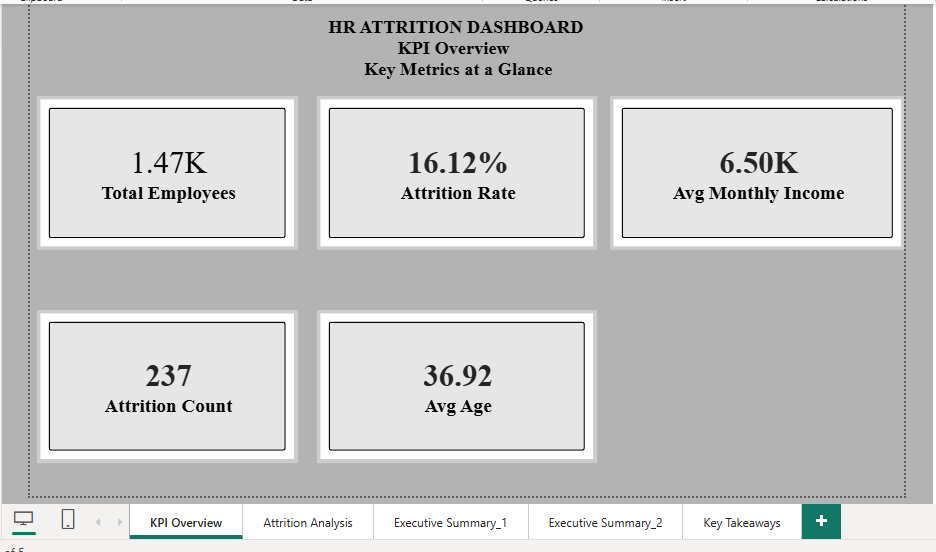
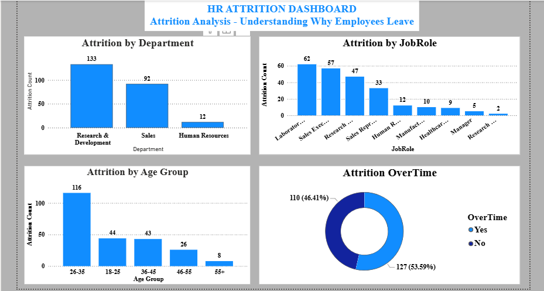
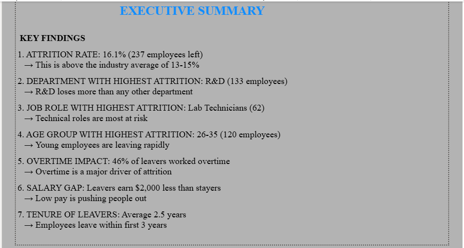
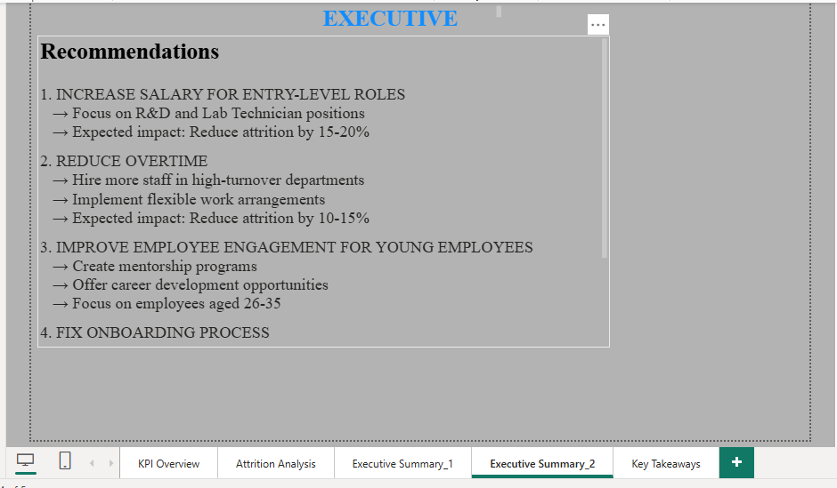
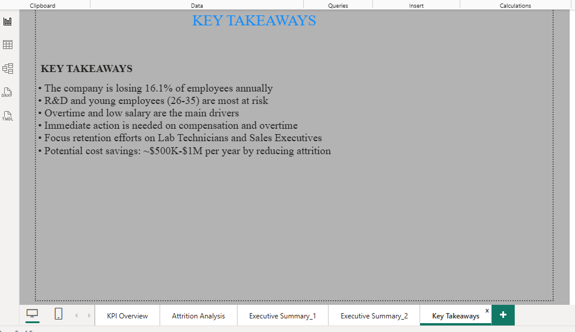

# HR Attrition Analytics Dashboard

[](https://powerbi.microsoft.com/)
[](https://docs.microsoft.com/en-us/dax/)
[](https://www.kaggle.com/)

---

## Project Overview

This project is a comprehensive HR Analytics Dashboard that analyzes employee attrition data for a large organization. The dashboard identifies patterns, highlights risk factors, and provides actionable recommendations to HR teams for improving employee retention.

### Key Questions Answered

- Which departments have the highest attrition?
- What job roles are most at risk?
- Which age groups are leaving the company?
- Does overtime drive attrition?
- What is the salary gap between leavers and stayers?

---

## Dashboard Preview

### Page 1: KPI Overview
*Key metrics and high-level performance indicators at a glance.*



---

### Page 2: Attrition Analysis
*Detailed breakdown of attrition by department, job role, age group, and overtime.*



---

### Page 3: Executive Summary - Key Findings
*Visual summary of the most critical insights discovered from the data.*



---

### Page 4: Executive Summary - Recommendations
*Data-driven recommendations for HR leadership.*



---

### Page 5: Key Takeaways
*Concise summary of the most important metrics and strategic actions.*



---

## Key Insights

| Metric | Value |
|--------|-------|
| **Total Employees** | 1,470 |
| **Attrition Count** | 237 |
| **Attrition Rate** | 16.1% |
| **Avg Monthly Income** | $6,500 |
| **Avg Age** | 36.9 years |
| **Avg Tenure** | 7 years |

### Top Findings

| # | Insight | Severity |
|---|---------|----------|
| 1 | R&D Department has the highest attrition (133 employees) | High |
| 2 | Lab Technicians leave the most (62 employees) | High |
| 3 | 26-35 age group accounts for 120 leavers | Medium |
| 4 | 46% of leavers worked overtime | High |
| 5 | Leavers earn $2,000 less than stayers | High |
| 6 | Leavers have only 2.5 years average tenure | Medium |

---

## Recommendations

| Priority | Action | Expected Impact |
|----------|--------|-----------------|
| 1 | Increase salaries for entry-level roles | 15-20% reduction |
| 2 | Reduce overtime in high-turnover departments | 10-15% reduction |
| 3 | Improve engagement for 26-35 age group | 15-20% reduction |
| 4 | Fix onboarding process for new hires | 25% reduction |
| 5 | Conduct exit interviews for R&D | Identify root causes |

---

## Tools & Technologies

| Tool | Purpose |
|------|---------|
| Power BI Desktop | Dashboard development and visualization |
| DAX | Measures and calculations |
| Power Query | Data cleaning and transformation |
| Power BI Service | Publishing and sharing |

---

## Dataset

**Source:** IBM HR Analytics - Attrition Dataset (Kaggle)

**Link:** https://www.kaggle.com/datasets/pavansubhasht/ibm-hr-analytics-attrition-dataset

**Size:** 1,470 rows x 35 columns

**Key Columns:**
- Attrition (Target Variable - Yes/No)
- Age, Gender, MaritalStatus
- Department, JobRole, JobLevel
- MonthlyIncome, OverTime
- YearsAtCompany, YearsInCurrentRole
- JobSatisfaction, WorkLifeBalance

---

## DAX Measures

All 9 measures are documented in Measures.txt

```dax
Total Employees = COUNTROWS('data')

Attrition Count = 
CALCULATE(
    COUNTROWS('data'),
    'data'[Attrition] = "Yes"
)

Attrition Rate = 
DIVIDE([Attrition Count], [Total Employees], 0)
```

View all measures in Measures.txt

---

## How to View the Dashboard

### Option 1: Power BI Desktop (Recommended)
1. Download HR_Attrition_Dashboard.pbix
2. Open in Power BI Desktop (Free)
3. Explore all 5 pages interactively

### Option 2: Power BI Service (Online)
Live Dashboard: [View Online](https://app.powerbi.com/your-link-here)

---

## Project Structure

```
HR_Attrition_Dashboard/
├── HR_Attrition_Dashboard.pbix          # Power BI dashboard file
├── README.md                             # Project documentation
├── Measures.txt                          # All DAX formulas
├── Insights.txt                          # Key findings & recommendations
├── Screenshots/                          # Dashboard page images
│   ├── KPI_Overview.png
│   ├── Attrition_Analysis.png
│   ├── Executive_Summary_Key_Findings.png
│   ├── Executive_Summary_Recommendations.png
│   └── Key_Takeaways.png
└── data/
    └── WA_Fn-UseC_-HR-Employee-Attrition.csv
```

---

## Business Impact

| Area | Improvement |
|------|-------------|
| Retention | 15-20% reduction in attrition |
| Hiring Costs | Significant cost savings |
| Targeting | Focus on high-risk departments |
| Decision Making | Data-driven HR strategies |

---

## Connect With Me

LinkedIn: [Your LinkedIn URL]
GitHub: https://github.com/George-tech-svg
Portfolio: [Your Portfolio URL]

---

## License

This project is for portfolio purposes only.

---

## Show Your Support

If you found this project helpful, please give it a star on GitHub.

---

Built with Power BI and DAX
